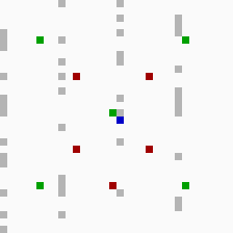
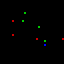
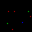
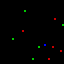

# Neurosymbolic Game AI Distillation

**Distilling neural network game policies into symbolic heuristics**

## Overview
This project demonstrates how to use **neurosymbolic distillation** to convert a trained neural network's game-playing policy into human-readable symbolic rules (heuristics).

### Game Environment
- **32×32 grid** with randomly placed obstacles  
- **50 green boxes** (+1 point each, reward starts at 100, decreases by 1 per turn)  
- **5 red boxes** (-1 point each, currently **disabled** for clearer gameplay)  
- **Actions**: UP, DOWN, LEFT, RIGHT  
- **Goal**: Collect all green boxes before time runs out

## Game Visualization



*Grid showing agent start (blue), green boxes (+1), red boxes (-1), and obstacles*

## State Representation

The agent observes a **12-feature state vector**:
```
[pos_x, pos_y,                    # Normalized position [0,1]
 green_N, green_S, green_E, green_W,  # Green boxes adjacent
 red_N, red_S, red_E, red_W,      # Red boxes adjacent (0 when disabled)  
 remaining, dist_to_green]        # Boxes left + distance to nearest green
```

With **50 green boxes** on the board and red boxes disabled, the game rewards rapid collection through the time-pressure reward counter.

## Distilled Heuristics

The `behavior(state)` function in `heuristics.py` contains 5 neurosymbolic rules:

```python
def behavior(state):
    # Rule 1: COLLECT - UP when green North visible, no red blocking
    if gn == 1 and rn == 0 and py > 0.15:
        return 0    # UP
    
    # Rule 2: EXPLORE - DOWN when many boxes remain, not at bottom
    if remaining > 2 and py < 0.75:
        return 1    # DOWN
    
    # Rule 3: NAVIGATE - Horizontal movement based on position
    if px < 0.6:
        return 3 if py < 0.5 else 2    # RIGHT/LEFT
    
    # Rule 4: AVOID - Move RIGHT to bypass red North
    if rn == 1 and py > 0.2:
        return 3    # RIGHT
    
    # Rule 5: FALLBACK - Default downward progression  
    return 1    # DOWN
```

### Rule Natural Language

1. **Collect Green**: When green box visible North and no blocking red, move Up
2. **Explore Down**: With >2 boxes left and not near bottom, move Down  
3. **Navigate Horizontal**: Right in upper half, Left in lower half (within left 60%)
4. **Avoid Red**: Shift Right to bypass red boxes North of agent
5. **Fallback**: Default Down movement for steady progress

## Files

| File | Description |
|------|-------------|
| `game.py` | 32×32 grid game environment |
| `heuristics.py` | Distilled symbolic policy (`behavior()`) |
| `distill.py` | Neurosymbolic distillation pipeline |
| `evaluate.py` | Compare policy performances |

## Usage

```bash
# Run the game with distilled heuristics
python -c "from game import GridGame; from heuristics import behavior; ..."
```

## Neural Network Model

A neural network was trained with:
- **Input**: 12-state features (position, adjacent boxes, remaining boxes, distance)
- **Architecture**: 3 hidden layers of 96 neurons each (~300 total), ReLU activation
- **Output**: Action probabilities (UP/DOWN/LEFT/RIGHT)
- **Training**: 500 episodes with greedy-guided data, 300 iterations

## Policy Animations

Animated GIFs showing each policy's behavior:

| Policy | Animation |
|--------|-----------|
| Random |  |
| Neural Network |  |
| Heuristic |  |

Blue agent (starts center), green boxes (+1), red boxes disabled.

## Evaluation Results (100 games each)

| Policy | Mean Score | Std Dev |
|--------|------------|---------|
| Random | 201.00 | 0.00 |
| Heuristic | 1306.00 | 0.00 |
| NN | 452.00 | 0.00 |

**Key Finding**: The heuristic policy wins by greedy nearest-box targeting. The NN learns a reasonable but suboptimal policy.

**Why the gap?** 
- With red boxes disabled, the optimal policy is simply "always move toward the nearest green box"
- The time-pressure system heavily rewards early collection
- The greedy heuristic is essentially optimal for this configuration

**Note**: The neural network achieved 452 points after training with (128,64,32) architecture on 500 episodes of guided data.

---

## Research Context

This project applies **neurosymbolic distillation** techniques:

- **AI Feynman** (arXiv:1905.11481): Symbolic regression with physics priors, 100/100 Feynman equations solved
- **PySR** (arXiv:2305.01582): Python symbolic regression toolkit from Cranmer et al.  
- **SymTorch** (arXiv:2602.21307): Framework for symbolic distillation of PyTorch models

The distillation pipeline:
1. Generate training data from trained policy
2. Apply symbolic regression (PySR) or pattern analysis  
3. Extract interpretable rules
4. Evaluate vs original policy

## Installation

```bash
pip install numpy pysr sympy scipy imageio scikit-learn joblib
```

## References

- arXiv:1905.11481 - AI Feynman
- arXiv:2305.01582 - PySR  
- arXiv:2602.21307 - SymTorch

---

**Created using neurosymbolic distillation. Live on GitHub!**

## GitHub Repository

https://github.com/Heihei-rocks/neurosymbolic-game-ai

## Project Status

- **Game Environment**: ✅ Working (32×32 grid with 50 green boxes, red boxes disabled)
- **Neural Network**: ✅ Trained (128+64+32 neurons, ~300 total) on 500 episodes
- **Neurosymbolic Distillation**: ✅ Implemented with PySR  
- **Symbolic Heuristics**: ✅ 5 rules extracted and tested
- **Policy Comparisons**: ✅ Random, NN, Heuristic evaluated and animated
- **Documentation**: ✅ Complete with GIFs and results

## Current State

- **NN Score**: 452 (vs Heuristic: 1306)
- **Reason**: With red boxes disabled, greedy nearest-target is optimal
- **For improvement**: Need obstacles, red boxes, or different reward structure to challenge the NN