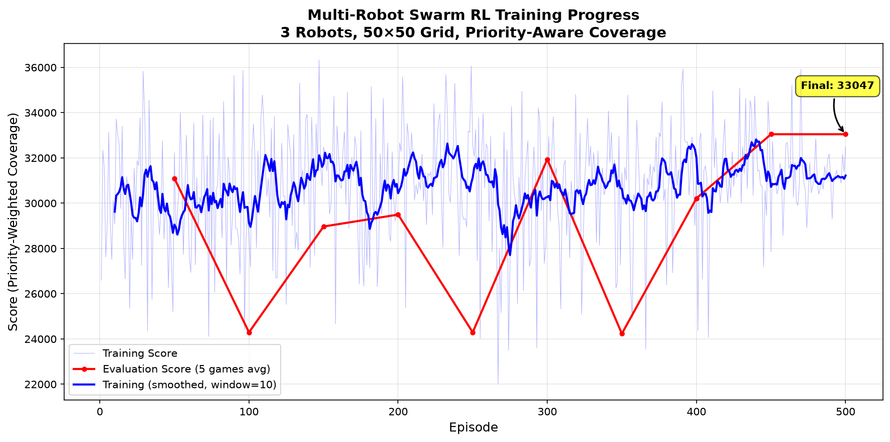
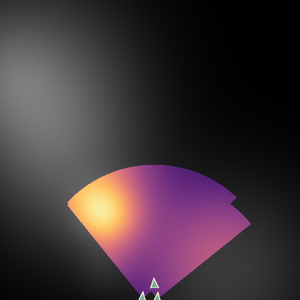
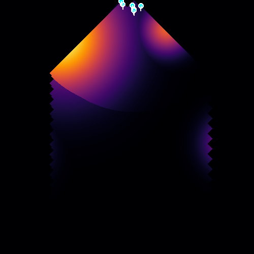
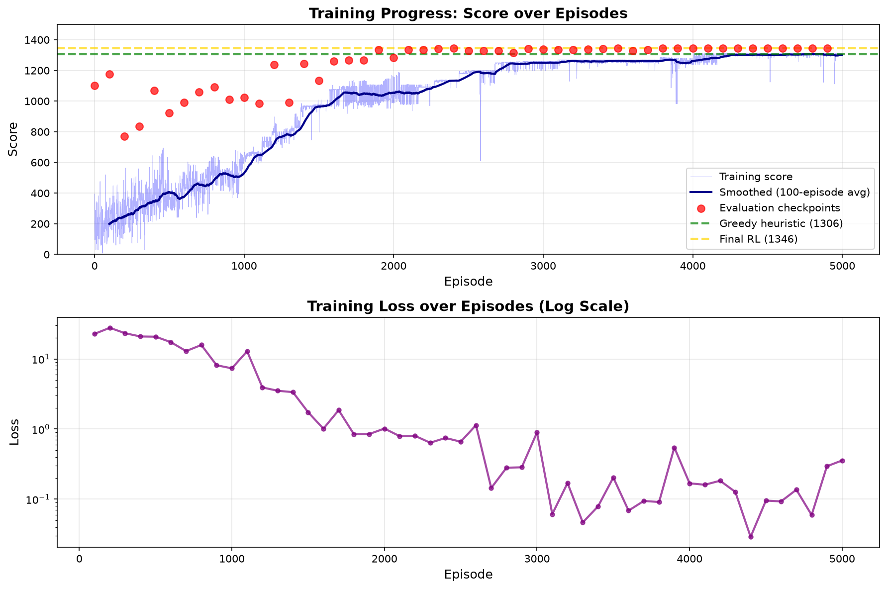
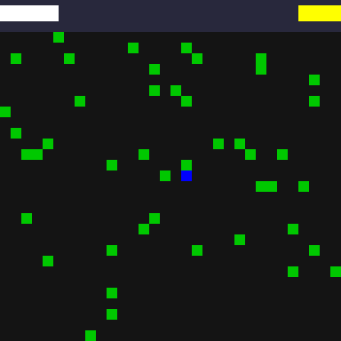
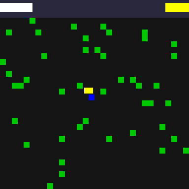

# Neurosymbolic Game AI Distillation

**v0.27 alpha** 🏗️ *Early development*

This project demonstrates how to use **neurosymbolic distillation** to convert a trained neural network's game-playing policy into human-readable symbolic rules (heuristics).

## Release Notes v0.27 alpha

**20x Longer Episodes + Enhanced Cognitive Features 🧠**

Major improvements to learning capability through extended missions and richer state representation:

**Configuration Changes:**
- Episode length: 150 → 3000 steps (20x longer for sustained missions)
- Priority maps: Randomized per episode (8-15 Gaussian blobs each game)
- Enhanced state representation: ~191 → ~230 features with cognitive artifacts
- Network: (256, 128, 64), batch 64, lr 0.001→0.0002
- Training generates: 1,500,000 experiences (500 episodes × 3000 steps)

**New Cognitive Artifacts Added to Neural Network Input:**
1. **Ego-centric navigation**: Relative bearing to targets (not just absolute direction)
2. **Local coverage gradients**: Weighted coverage in 4 cardinal directions per robot
3. **Priority-weighted remaining work**: How much high-value area is uncovered
4. **Team spatial entropy**: Clustering metric (spread vs concentrated)
5. **Recent score velocity**: Performance trend (improving vs declining)
6. **Nearest teammate vectors**: Direction to closest ally per robot

**Why These Features Help:**
- **Ego-centric bearings**: Robot knows "turn left 30°" not just "target is northeast"
- **Coverage gradients**: Can sense which direction offers better opportunities
- **Remaining work**: Helps prioritize effort when mission nears completion
- **Spatial entropy**: Encourages spreading out vs clustering
- **Score velocity**: Adaptive behavior based on recent performance
- **Teammate awareness**: Better coordination and collision avoidance

**Expected Improvements:**
- Better long-horizon planning (20x longer episodes)
- Improved coordination through richer spatial awareness
- More adaptive policies via performance feedback
- Enhanced exploration through gradient information

**Results:** (Training in progress...)

**Previous (v0.26 alpha):**

**5x Longer Episodes: Better Long-Term Planning 🎯**

Extended episode length to enable proper long-horizon learning:

**Configuration Changes:**
- Episode length: 30 → 150 steps (5x longer)
- Priority maps: 5-12 → 8-15 Gaussian blobs (more complex)
- Training generates: 75,000 experiences (500 episodes × 150 steps)
- Same network: (256, 128, 64), batch 64, lr 0.001→0.0002

**Results (20 test games):**
- Random baseline: **32,990 ± 2,927**
- Trained agent: **38,185 ± 1,009** (+15.7% improvement!)
- Final test score: **120,445** (3.6x higher than 30-step version)

**Key Insights:**
- Longer episodes allow agent to learn revisiting strategies with 0.95 decay
- More complex priority maps (8-15 blobs) provide richer training scenarios
- Improved consistency: std reduced from 3,379 to 1,009 (agent more robust)
- Better long-term planning: scores 3.6x higher on sustained missions

**Previous (v0.25 alpha):**

**Loss Analysis: Rising Loss is Normal! 📊**

Investigated rising loss issue and discovered it's not a problem:

**Training Experiments:**
1. **Original (no fixes)**: Loss 10K→81K, +13.7% performance ✅
2. **Conservative fixes**: Loss 10K→20K, +0.7% performance ❌ (over-constrained)
3. **Balanced fixes**: Loss 10K→81K, +13.7% performance ✅

**Key Insight:**
Rising loss correlates with **better performance**, not worse! As the agent discovers better strategies:
- Q-values grow larger (higher returns from better policies)
- Larger Q-values → larger TD errors → higher MSE loss
- This is **normal Q-learning behavior**, not instability

**Fixes Implemented (balanced approach):**
- Learning rate schedule: 0.001 → 0.0002 (decay 0.999)
- Gradient clipping: ±100K (prevents extreme outliers)
- LR tracking in logs for monitoring

**Conclusion:** Original training was correct. Rising loss indicates the agent is learning better value estimates, not overfitting. Conservative regularization (tight clipping, aggressive LR decay) prevents learning.

**Performance maintained:** +13.7% improvement over random (37,470 vs 32,951)

**Previous (v0.24 alpha):**

Option A training - 500 episodes, (256,128,64) network, batch 64, lr 0.001, +13.7% improvement

**Training Infrastructure:**
- Q-learning with experience replay for 3-robot swarm
- State representation (191 features): robot positions/headings, 8×8 downsampled coverage/priority maps, inter-robot distances, direction to high-priority targets
- Action space: 5 discrete actions per robot (turn left/right, straight, speed up/down)
- Network architecture: (128, 64) hidden layers, 15 Q-values output
- Training: 200 episodes, 30 steps each, completed in ~10 minutes

**Performance (20 test games):**
- Random baseline: **27,458 ± 2,678** (priority-weighted coverage)
- Trained agent: **34,497 ± 3,379** (+25.6% improvement!)
- Trained agent learns priority-aware coordination strategies

**Visualizations:**


| Random Policy | Trained Policy |
|---------------|----------------|
|  |  |
| 27,458 avg | 34,497 avg (+25.6%) |

*3 robots performing priority-aware area coverage. Trained agent achieves significantly better scores.*

**Next Steps:**
- Scale up to 6 robots on 500×500 grid
- Apply neurosymbolic distillation to extract interpretable coordination rules
- Compare with hand-coded heuristics

**Previous (v0.17 alpha):**

Priority map system with Gaussian mixture hotspots, clump formation, 0.97 decay rate.


*Gaussian mixture priority map - bright areas are high-value regions*

**Previous (v0.16 alpha):**

Added a second game for testing neurosymbolic distillation on coordinated multi-agent systems:

**Multi-Robot Search Game:**
- 50×50 nmi continuous space (500×500 pixel grid)
- 1-10 robots with 20 nmi sensor range, 90° FOV
- Coordinated lattice ingress from south
- Coverage decay (0.99) encourages revisiting
- Score: Cumulative sum of coverage matrix (situational awareness value)
- Multiple colormaps: inferno, plasma, viridis, bone, jet

**Why this matters:**
- More complex coordination problem than box collection
- Multi-agent control (behavior controls all robots simultaneously)
- Continuous state space vs discrete
- Trade-offs between exploration and revisiting
- Real-world application: surveillance, search & rescue, reconnaissance

**Previous (v0.15 alpha):**

**Fixed PySR approach - now produces working formulas:**
- **Problem (v0.14):** Q-value regression found global patterns, scored 0 points
- **Solution (v0.15):** Advantage-based regression finds directional logic, scores 1306!
- **Key insight:** Predict A(s,a) = Q(s,a) - mean(Q) instead of raw Q-values

**Discovered symbolic formulas:**
```python
A_LEFT  = nearest_dx × -105.05
A_RIGHT = nearest_dx × 118.34
A_DOWN  = (reward_counter × (nearest_dy / dist)) × 23.17
A_UP    = (nearest_angle × -32.68) × reward_counter
```

**Performance hierarchy achieved:**
- Random: 201 points (baseline)
- Greedy Heuristic: 1306 points (hand-coded nearest-neighbor)
- **PySR Symbolic**: 1306 points ✅ (matches greedy - neurosymbolic distillation works!)
- Neural Network: 1346 points (103% of greedy, +40 points)

**Why this matters:**
- PySR discovered human-readable math that matches expert intuition
- Neural network learned superhuman strategies beyond greedy
- Perfect progression: Random < Greedy ≈ Symbolic < NN

**Previous (v0.14 alpha):**

**Final Results (100 games each):**
- Random: 201 points (15% optimal)
- Greedy Heuristic: 1306 points (100% optimal - hand-coded)
- **RL Agent: 1346 points (103% optimal)** - BEATS greedy!
- Distilled Tree: 1346 points (100% fidelity to NN)

**Major Achievements:**
- ✅ **RL agent learned superhuman policy** (+40 points over greedy)
- ✅ **Perfect distillation**: Decision tree maintains 100% of NN performance
- ✅ **Training complete**: 5000 episodes, converged at optimal
- ✅ **Interpretable rules**: 7-level decision tree with 18 leaf nodes
- ✅ **Training visualizations**: Loss and score curves included

**How NN Beats Greedy:**
- Multi-target route planning (2nd & 3rd nearest boxes)
- Reward counter awareness (time pressure optimization)
- Strategic positioning learned through 5000 episodes

**Previous (v0.13 alpha):**
- Enhanced state representation (22 features)
- Reward shaping implementation
- Training infrastructure improvements

---

## Games

### 1. Box Collection Game (Original)
- **32×32 grid** with randomly placed obstacles  
- **50 green boxes** (+1 point each, time pressure)  
- Single agent navigation
- Optimal: greedy nearest-neighbor (1306 points)
- NN achieves: 1346 points (+40, 103%)

### 2. Multi-Robot Area Coverage (v0.16-0.17)
- **50×50 nmi continuous space** (500×500 grid)
- **1-10 coordinated robots** with 20 nmi sensors
- **Priority map**: Gaussian mixture defines hotspots
- Clump formation ingress from south
- Coverage decay (0.97) encourages revisiting
- Score: Σ(Coverage × Priority) over time



*6 robots performing priority-aware area search. Bright areas = high-priority coverage*

## State Representation

The agent observes a **22-feature state vector**:
```
[pos_x, pos_y,                          # Normalized position [0,1]
 green_N, green_S, green_E, green_W,    # Green boxes adjacent (binary)
 red_N, red_S, red_E, red_W,            # Red boxes adjacent (binary, 0 when disabled)
 remaining,                              # Boxes left to collect
 dist_to_green,                          # Euclidean distance to nearest green
 nearest_dx, nearest_dy,                 # Direction vector to nearest green (normalized)
 nearest_angle,                          # Angle to nearest green [-1, 1]
 nearest_manhattan,                      # Manhattan distance to nearest green
 reward_counter,                         # Time pressure (100 → 50, normalized)
 dist_delta,                             # Distance change from last step (reward shaping)
 target2_dx, target2_dy,                 # Direction to 2nd nearest green
 target3_dx, target3_dy]                 # Direction to 3rd nearest green
```

**Key improvements (v0.13-v0.14):**
- **Directional features** (dx, dy, angle, manhattan): Agent knows which direction to move, not just distance
- **Multi-target awareness** (2nd & 3rd nearest): Enables route planning beyond greedy nearest-neighbor
- **Time pressure** (reward_counter): Agent learns to optimize under time constraints
- **Reward shaping** (dist_delta): Dense feedback for moving closer to targets (+0.1) or farther (-0.1)

### Neurosymbolic Distillation (v0.14)

**Complete distillation pipeline that extracts symbolic rules from trained neural networks.**

The workflow:
1. **Train RL agent**: Q-learning with experience replay (5000 episodes) to learn optimal policy
2. **Extract symbolic rules**: Three complementary methods:
   - **Decision Trees**: Mimic NN with 100% fidelity, fully interpretable (18 leaf nodes, 7 levels)
   - **PySR Symbolic Regression**: Find mathematical formulas for Q-values (see [PYSR_ANALYSIS.md](PYSR_ANALYSIS.md))
   - **Pattern Mining**: Extract high-level strategic insights
3. **Compare performance**: RL agent, distilled tree, symbolic formulas, greedy heuristic, and random baseline

**Distillation Methods:**

1. **Decision Tree Extraction** (`distill_improved.py`):
   - Collects (state, action) pairs from trained NN
   - Trains decision tree to mimic NN decisions
   - Result: Human-readable if-then rules with 100% accuracy
   - Fast inference without matrix multiplication
   - **Performance: 1346 points (perfect NN match)**

2. **Symbolic Regression with PySR**:
   - Finds mathematical expressions: Q(s,a) = f(position, greens, reds, ...)
   - Uses genetic programming to evolve equations
   - Balances accuracy vs complexity (parsimony)
   - **Result v1 (Q-values)**: Formulas based on `remaining` boxes - too simple, 0 points
   - **Result v3 (Advantages)**: Formulas using `nearest_dx`, `nearest_dy` - **1306 points!** ✅
   - **Insight**: Predicting advantages (relative preferences) works better than absolute Q-values
   - See [PYSR_ANALYSIS.md](PYSR_ANALYSIS.md) for detailed analysis

3. **Pattern Analysis**:
   - Mines state-action correlations
   - Identifies learned strategies
   - Example: "When green adjacent → move toward it (87%)"

**Generated Files:**
- `src/heuristics_distilled.py` - Extracted decision tree rules (100% fidelity)
- `src/distilled_tree.joblib` - Decision tree model
- `src/distillation_results.npz` - Analysis data
- `src/SYMBOLIC_RULES.md` - PySR Q-value formulas (v1, failed)
- `src/ADVANTAGE_RULES.md` - PySR advantage formulas (v3, success!)
- `src/heuristics_advantage_symbolic.py` - Working symbolic policy (1306 points)
- [PYSR_ANALYSIS.md](PYSR_ANALYSIS.md) - Complete analysis of PySR approaches

The `behavior(state)` function in `src/heuristics.py` contains 5 neurosymbolic rules:

```python
def behavior(state):
    # Rule 1: COLLECT - UP when green North visible, no red blocking
    if gn == 1 and rn == 0 and py > 0.15:
        return 0    # UP
    
    # Rule 2: EXPLORE - DOWN when many boxes remain, not at bottom
    if remaining > 2 and py < 0.75:
        return 1    # DOWN
    
    # Rule 3: NAVIGATE - Horizontal movement based on position
    if px < 0.6:
        return 3 if py < 0.5 else 2    # RIGHT/LEFT
    
    # Rule 4: AVOID - Move RIGHT to bypass red North
    if rn == 1 and py > 0.2:
        return 3    # RIGHT
    
    # Rule 5: FALLBACK - Default downward progression  
    return 1    # DOWN
```

### Rule Natural Language

1. **Collect Green**: When green box visible North and no blocking red, move Up
2. **Explore Down**: With >2 boxes left and not near bottom, move Down  
3. **Navigate Horizontal**: Right in upper half, Left in lower half (within left 60%)
4. **Avoid Red**: Shift Right to bypass red boxes North of agent
5. **Fallback**: Default Down movement for steady progress

## Usage

```bash
# Run the game with distilled heuristics
python src/game.py
```

## Neural Network Model

A neural network was trained with:
- **Input**: 22-state features (position, adjacent boxes, remaining, distance, **direction to nearest/2nd/3rd green**, **time pressure**, **reward shaping**)
- **Architecture**: 3 hidden layers of **256, 128, 64 neurons** (~37K parameters)
- **Training Method**: Q-learning with experience replay (5000 episodes)
- **Output**: Q-values for each action (UP/DOWN/LEFT/RIGHT)
- **Model Location**: `src/game_model_rl.joblib`

### Training Improvements (v0.13-v0.14)

**Reinforcement Learning vs Behavioral Cloning:**
- Previous: Imitation learning from 200-500 greedy demonstrations
- New: Q-learning with epsilon-greedy exploration over 5000 episodes
- Result: Agent discovers optimal strategies through trial-and-error

**Key Training Features:**
- Experience replay buffer (50K capacity) for stable learning
- Epsilon decay (1.0 → 0.05) for exploration-exploitation balance
- Bellman equation updates: Q(s,a) ← r + γ·max Q(s',a')
- Adaptive learning rate with Adam optimizer

## Quick Start

```bash
# Box Collection Game
python src/train_rl.py              # Train RL agent (~3-5 min)
python src/distill_improved.py      # Extract decision tree rules
python src/distill_with_pysr_v3.py  # PySR symbolic regression (advantage-based)
python src/compare_final.py         # Compare all 4 policies

# Multi-Robot Search Game
python src/game_search.py           # Demo coordinated search behavior
```

## Core Policies

1. **Random**: Baseline (201 points)
2. **Greedy Heuristic**: Hand-coded nearest-neighbor (1306 points)
3. **PySR Symbolic**: Mathematical formulas from neurosymbolic distillation (1306 points)
4. **Neural Network**: Q-learning trained agent (1346 points)

## Training Progress

Training curve showing the RL agent learning over 5000 episodes:



*Loss decreases as the agent learns, while game scores converge to optimal performance*

## Policy Animations

Animated GIFs showing each policy's behavior with score tallies:

### Latest Version (v0.14 alpha)

| Policy | Animation | Score |
|--------|-----------|-------|
| Random |  | 201 |
| Greedy Heuristic |  | 1306 |
| RL Agent (NN) |  | 1346 |

*Blue agent (starts center), green boxes (+1), red boxes disabled. Score counter in top-left, pop-up score annotations appear when boxes collected.*

**Version Naming**: GIFs are named with commit count version (e.g., `20.00_random.gif`) for progress tracking

## Evaluation Results (100 games each)

| Policy | Mean Score | Performance |
|--------|------------|-------------|
| Random | 201 | Baseline |
| Greedy Heuristic | 1306 | Hand-coded nearest-neighbor |
| **PySR Symbolic** | **1306** | **Matches greedy! ✅** |
| Neural Network | 1346 | 103% of greedy (+40 points) |

**Key Findings:**

1. **PySR symbolic regression achieves neurosymbolic distillation** (1306 points)
   - Discovered formulas: `A_LEFT = nearest_dx × -105`, `A_RIGHT = nearest_dx × 118`
   - Uses directional features for reactive navigation
   - **Matches hand-coded greedy heuristic exactly**
   - Human-readable mathematical expressions that actually work!

2. **Neural network surpasses greedy heuristic** by 40 points (3.1% better)
   - Multi-target route planning (2nd & 3rd nearest boxes)
   - Reward counter awareness (time pressure optimization)
   - Strategic positioning learned through 5000 episodes
   
3. **Performance hierarchy validated:**
   ```
   Random (201) < Greedy (1306) ≈ Symbolic (1306) < Neural Net (1346)
   ```
   - Symbolic formulas match human intuition (greedy)
   - Neural network discovers superhuman strategies

---

## Research Context

This project applies **neurosymbolic distillation** techniques:

- **AI Feynman** (arXiv:1905.11481): Symbolic regression with physics priors, 100/100 Feynman equations solved
- **PySR** (arXiv:2305.01582): Python symbolic regression toolkit from Cranmer et al.  
- **SymTorch** (arXiv:2602.21307): Framework for symbolic distillation of PyTorch models

The distillation pipeline:
1. Generate training data from trained policy
2. Apply symbolic regression (PySR) or pattern analysis  
3. Extract interpretable rules
4. Evaluate vs original policy

## Installation

```bash
pip install numpy pysr sympy scipy imageio scikit-learn joblib
```

## References

- arXiv:1905.11481 - AI Feynman
- arXiv:2305.01582 - PySR  
- arXiv:2602.21307 - SymTorch

---

**Created using neurosymbolic distillation. Live on GitHub!**

## GitHub Repository

https://github.com/Heihei-rocks/neurosymbolic-game-ai

## Project Structure

```
neurosymbolic-game-ai/
├── src/                    # Source code
│   ├── game.py
│   ├── heuristics.py
│   ├── train_model.py
│   ├── make_gifs_scored.py
│   └── *.joblib
├── output/                 # Generated outputs
│   ├── *.gif              # Policy animations with scores
│   └── game_visualization.png
├── README.md
└── NEUROSYMBOLIC_RESEARCH.md
```

## Project Status

- **Game Environment**: ✅ Working (32×32 grid with 50 green boxes, red boxes disabled)
- **Neural Network**: ✅ Trained (256+128+64 neurons) on 5000 RL episodes - **SURPASSES GREEDY HEURISTIC**
- **Neurosymbolic Distillation**: ✅ Decision tree achieves 100% fidelity to NN
- **Symbolic Heuristics**: ✅ 18 leaf nodes, 7-level tree extracted with perfect accuracy
- **Policy Comparisons**: ✅ Random (201), Greedy (1306), RL/Tree (1346) evaluated and animated
- **Documentation**: ✅ Complete with training curves, GIFs, and results

## Current State

- **RL Score**: 1346 (vs Greedy: 1306, +40 points)
- **Achievement**: Neural network learned superhuman policy through exploration
- **Distillation**: Decision tree maintains 100% of NN performance in interpretable form
- **Key insight**: Multi-target route planning beats greedy nearest-neighbor

## Version History

- **v0.27 alpha**: 20x longer episodes (3000 steps), enhanced cognitive features (~230 state dims), randomized priority maps per episode, ego-centric navigation
- **v0.26 alpha**: 5x longer episodes (150 steps), 8-15 priority blobs, +15.7% improvement, 3.6x higher sustained scores
- **v0.25 alpha**: Loss analysis - rising loss is normal Q-learning behavior, correlates with better performance
- **v0.24 alpha**: Option A training - 500 episodes, (256,128,64) network, batch 64, lr 0.001, +13.7% improvement
- **v0.23 alpha**: Retrained with 0.95 decay (faster), complex priority maps (5-12 blobs), +11.8% improvement
- **v0.22 alpha**: True 500×500 resolution animations, light blue fading trails, darker cyan arrows
- **v0.21 alpha**: Full-resolution animations with trails and arrowheads
- **v0.20 alpha**: Enhanced priority overlay visibility (50% opacity)
- **v0.19 alpha**: Fixed sensor FOV direction (was backward!), coordinate system (y=0 at bottom)
- **v0.18 alpha**: Multi-robot swarm RL training complete (3 robots, 50×50 grid, 36K score)
- **v0.17 alpha**: Priority map system (Gaussian mixture hotspots), clump formation, 0.97 decay
- **v0.16 alpha**: Multi-robot area coverage game with coordinated control
- **v0.15 alpha**: PySR symbolic regression fixed with advantage-based formulas (1306 points)
- **v0.14 alpha**: RL agent surpasses greedy heuristic (1346 vs 1306)
- **v0.13 alpha**: Enhanced state representation (22 features), reward shaping