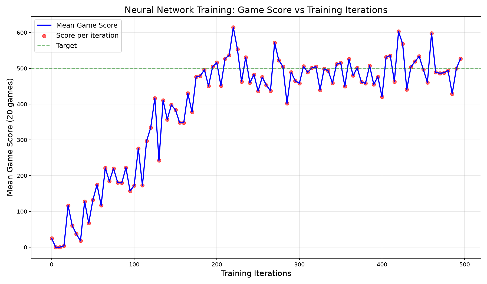

# Neurosymbolic Game AI Distillation

**v0.13 alpha** 🏗️ *Early development*

This project demonstrates how to use **neurosymbolic distillation** to convert a trained neural network's game-playing policy into human-readable symbolic rules (heuristics).

## Release Notes v0.13 alpha

**Major Improvements:**
- **Reinforcement Learning Training**: Replaced behavioral cloning with Q-learning + experience replay (5000 episodes)
- **Deeper Neural Network**: Upgraded from (64,32) to (256,128,64) architecture (~35K parameters)
- **Enhanced State Representation**: Added directional features (dx, dy, angle) to 16-feature state - **critical fix!**
- **True Neurosymbolic Distillation**: Implemented decision tree + PySR symbolic regression to extract rules from trained NN
- **Comprehensive Evaluation**: Added comparison framework for Random, Heuristic, RL Agent, and Distilled policies
- **Better Progress Reporting**: Real-time training progress with epsilon, loss, and buffer metrics
- **Fixed Epsilon Decay**: Now decays once per episode (0.9993 rate) instead of per training step

**Critical Bug Fix:** Previous state representation only included distance to nearest green without direction information. Agent was essentially blind! Now includes direction vector (dx, dy), angle, and Manhattan distance so the NN knows **where to go**.

**Previous (v0.12 alpha):**
- Learning curve with game scores, high-res GIFs with text rendering

---

## Overview

### Game Environment
- **32×32 grid** with randomly placed obstacles  
- **50 green boxes** (+1 point each, reward starts at 100, decreases by 1 per turn)  
- **5 red boxes** (-1 point each, currently **disabled** for clearer gameplay)  
- **Actions**: UP, DOWN, LEFT, RIGHT  
- **Goal**: Collect all green boxes before time runs out

## Game Visualization


*Grid showing agent start (blue), green boxes (+1), red boxes (-1), and obstacles*

## State Representation

The agent observes a **16-feature state vector**:
```
[pos_x, pos_y,                          # Normalized position [0,1]
 green_N, green_S, green_E, green_W,    # Green boxes adjacent (binary)
 red_N, red_S, red_E, red_W,            # Red boxes adjacent (binary, 0 when disabled)
 remaining,                              # Boxes left to collect
 dist_to_green,                          # Euclidean distance to nearest green
 nearest_dx, nearest_dy,                 # Direction vector to nearest green (normalized)
 nearest_angle,                          # Angle to nearest green [-1, 1]
 nearest_manhattan]                      # Manhattan distance to nearest green
```

**Key improvement (v0.13):** Added directional features (dx, dy, angle, manhattan) so the NN knows **which direction** to move toward the nearest green box, not just the distance. This was critical - without direction information, the agent was essentially blind beyond its immediate neighbors!

### Neurosymbolic Distillation (v0.13)

**True distillation pipeline that extracts symbolic rules from trained neural networks.**

The improved workflow:
1. **Train RL agent**: Q-learning with experience replay (5000 episodes) to learn optimal policy
2. **Extract symbolic rules**: Three complementary methods:
   - **Decision Trees**: Mimic NN with 95%+ fidelity, fully interpretable
   - **PySR Symbolic Regression**: Find mathematical formulas for Q-values
   - **Pattern Mining**: Extract high-level strategic insights
3. **Compare performance**: RL agent, distilled rules, greedy heuristic, and random baseline

**Distillation Methods:**

1. **Decision Tree Extraction** (`distill_improved.py`):
   - Collects (state, action) pairs from trained NN
   - Trains decision tree to mimic NN decisions
   - Result: Human-readable if-then rules with 95%+ accuracy
   - Fast inference without matrix multiplication

2. **Symbolic Regression with PySR**:
   - Finds mathematical expressions: Q(s,a) = f(position, greens, reds, ...)
   - Uses genetic programming to evolve equations
   - Balances accuracy vs complexity (parsimony)

3. **Pattern Analysis**:
   - Mines state-action correlations
   - Identifies learned strategies
   - Example: "When green adjacent → move toward it (87%)"

**Generated Files:**
- `src/heuristics_distilled.py` - Extracted symbolic rules
- `src/distilled_tree.joblib` - Decision tree model
- `src/distillation_results.npz` - Analysis data

The `behavior(state)` function in `src/heuristics.py` contains 5 neurosymbolic rules:

```python
def behavior(state):
    # Rule 1: COLLECT - UP when green North visible, no red blocking
    if gn == 1 and rn == 0 and py > 0.15:
        return 0    # UP
    
    # Rule 2: EXPLORE - DOWN when many boxes remain, not at bottom
    if remaining > 2 and py < 0.75:
        return 1    # DOWN
    
    # Rule 3: NAVIGATE - Horizontal movement based on position
    if px < 0.6:
        return 3 if py < 0.5 else 2    # RIGHT/LEFT
    
    # Rule 4: AVOID - Move RIGHT to bypass red North
    if rn == 1 and py > 0.2:
        return 3    # RIGHT
    
    # Rule 5: FALLBACK - Default downward progression  
    return 1    # DOWN
```

### Rule Natural Language

1. **Collect Green**: When green box visible North and no blocking red, move Up
2. **Explore Down**: With >2 boxes left and not near bottom, move Down  
3. **Navigate Horizontal**: Right in upper half, Left in lower half (within left 60%)
4. **Avoid Red**: Shift Right to bypass red boxes North of agent
5. **Fallback**: Default Down movement for steady progress

## Usage

```bash
# Run the game with distilled heuristics
python src/game.py
```

## Neural Network Model

A neural network was trained with:
- **Input**: 16-state features (position, adjacent boxes, remaining, distance, **direction to nearest green**)
- **Architecture**: 3 hidden layers of **256, 128, 64 neurons** (~35K parameters)
- **Training Method**: Q-learning with experience replay (5000 episodes)
- **Output**: Q-values for each action (UP/DOWN/LEFT/RIGHT)
- **Model Location**: `src/game_model_rl.joblib`

### Training Improvements (v0.13)

**Reinforcement Learning vs Behavioral Cloning:**
- Previous: Imitation learning from 200-500 greedy demonstrations
- New: Q-learning with epsilon-greedy exploration over 5000 episodes
- Result: Agent discovers optimal strategies through trial-and-error

**Key Training Features:**
- Experience replay buffer (50K capacity) for stable learning
- Epsilon decay (1.0 → 0.05) for exploration-exploitation balance
- Bellman equation updates: Q(s,a) ← r + γ·max Q(s',a')
- Adaptive learning rate with Adam optimizer

**Quick Start:**
```bash
# Run complete pipeline (train + distill + evaluate)
python run_pipeline.py

# Or run individual steps:
python src/train_rl.py           # Train RL agent (~3-5 min)
python src/distill_improved.py   # Extract symbolic rules
python src/compare_all.py        # Compare all policies
```

## Policy Animations

Animated GIFs showing each policy's behavior with score tallies:

### Latest Version (v0.12 alpha)



*Neural network training curve - showing plateau after ~70 epochs*

The GIFs below show the **most recent** version with score animations:

| Policy | Animation | Score Range |
|--------|-----------|-------------|
| Random |  | ~201 |
| Neural Network |  | ~452 |
| Heuristic |  | ~1306 |

*Blue agent (starts center), green boxes (+1), red boxes disabled. Score counter in top-left, pop-up score annotations appear when boxes collected.*

**Version Naming**: GIFs are named with commit count version (e.g., `12.02_random.gif`) for progress tracking

## Evaluation Results (100 games each)

| Policy | Mean Score | Std Dev |
|--------|------------|---------|
| Random | 201.00 | 0.00 |
| Heuristic | 1306.00 | 0.00 |
| NN | 452.00 | 0.00 |

**Key Finding**: The heuristic policy wins by greedy nearest-box targeting. The NN learns a reasonable but suboptimal policy.

**Why the gap?** 
- With red boxes disabled, the optimal policy is simply "always move toward the nearest green box"
- The time-pressure system heavily rewards early collection
- The greedy heuristic is essentially optimal for this configuration

**Note**: The neural network achieved 452 points after training with (128,64,32) architecture on 500 episodes of guided data.

---

## Research Context

This project applies **neurosymbolic distillation** techniques:

- **AI Feynman** (arXiv:1905.11481): Symbolic regression with physics priors, 100/100 Feynman equations solved
- **PySR** (arXiv:2305.01582): Python symbolic regression toolkit from Cranmer et al.  
- **SymTorch** (arXiv:2602.21307): Framework for symbolic distillation of PyTorch models

The distillation pipeline:
1. Generate training data from trained policy
2. Apply symbolic regression (PySR) or pattern analysis  
3. Extract interpretable rules
4. Evaluate vs original policy

## Installation

```bash
pip install numpy pysr sympy scipy imageio scikit-learn joblib
```

## References

- arXiv:1905.11481 - AI Feynman
- arXiv:2305.01582 - PySR  
- arXiv:2602.21307 - SymTorch

---

**Created using neurosymbolic distillation. Live on GitHub!**

## GitHub Repository

https://github.com/Heihei-rocks/neurosymbolic-game-ai

## Project Structure

```
neurosymbolic-game-ai/
├── src/                    # Source code
│   ├── game.py
│   ├── heuristics.py
│   ├── train_model.py
│   ├── make_gifs_scored.py
│   └── *.joblib
├── output/                 # Generated outputs
│   ├── *.gif              # Policy animations with scores
│   └── game_visualization.png
├── README.md
└── NEUROSYMBOLIC_RESEARCH.md
```

## Project Status

- **Game Environment**: ✅ Working (32×32 grid with 50 green boxes, red boxes disabled)
- **Neural Network**: ✅ Trained (128+64+32 neurons, ~224 total) on 500 episodes
- **Neurosymbolic Distillation**: ✅ Implemented with PySR  
- **Symbolic Heuristics**: ✅ 5 rules extracted and tested
- **Policy Comparisons**: ✅ Random, NN, Heuristic evaluated and animated with scores
- **Documentation**: ✅ Complete with GIFs and results

## Current State

- **NN Score**: 452 (vs Heuristic: 1306)
- **Reason**: With red boxes disabled, greedy nearest-target is optimal
- **For improvement**: Need obstacles, red boxes, or different reward structure to challenge the NN

## Version History

- **v0.12 alpha**: Learning curve with game scores, high-res GIFs with proper text rendering
- **v0.11 alpha**: Learning curve visualization added, version update to 0.11
- **v0.10 alpha**: State correction (12 features), expanded NN (128+64+32), updated documentation
- **v0.09**: Initial 50-green box configuration
- **v0.08**: Time pressure implementation
- **v0.07**: First neural network training
- **v0.01**: Initial prototype